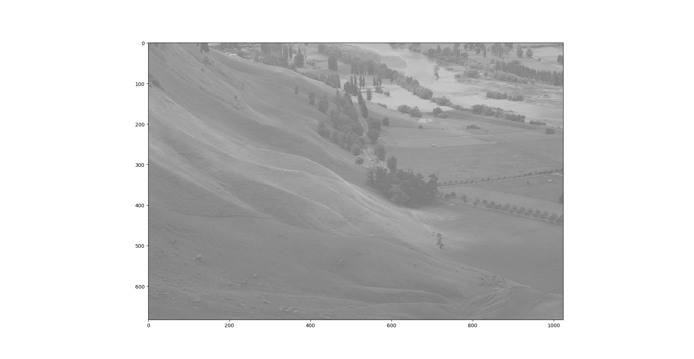

# Histogram Equalization
Python implementation of [histogram equalization](https://en.wikipedia.org/wiki/Histogram_equalization).

Unequalized image:

Equalized image:

Unequalized image histogram:

Equalized image histogram:

